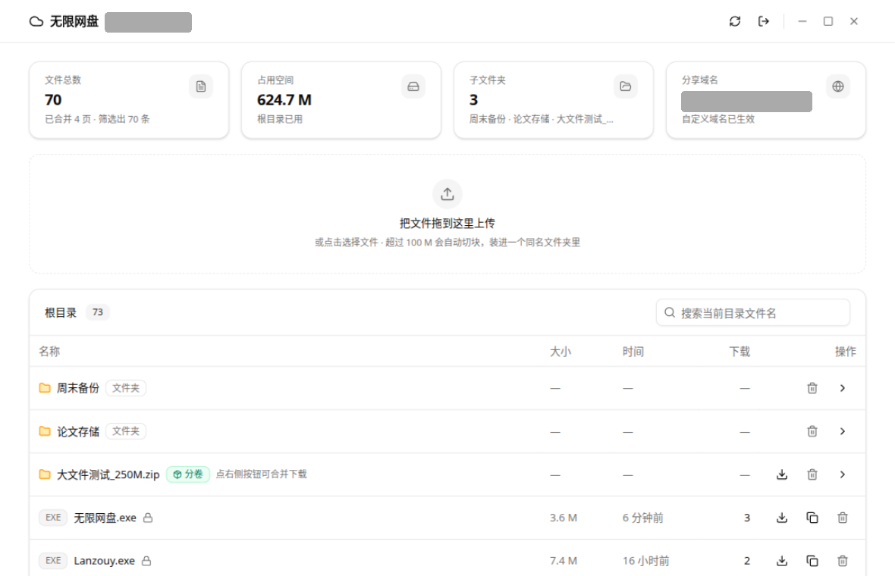
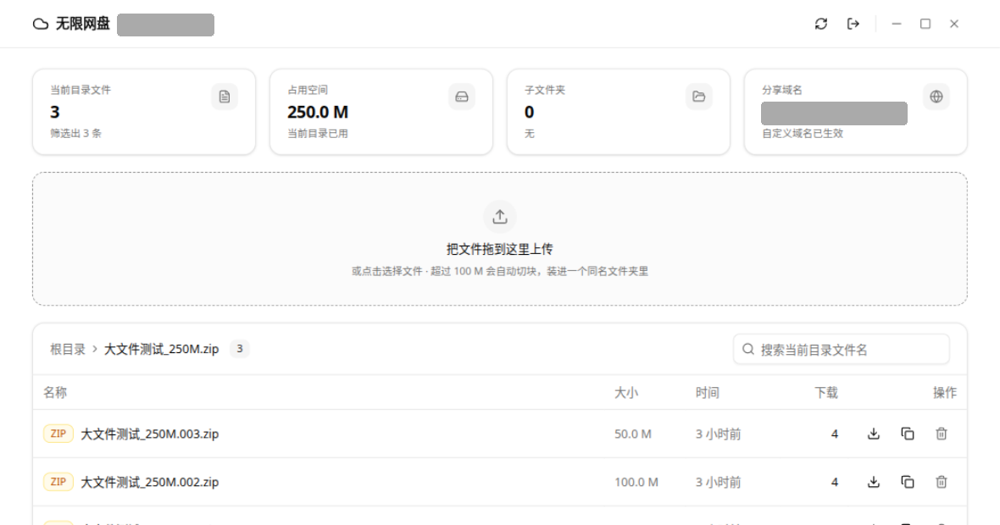
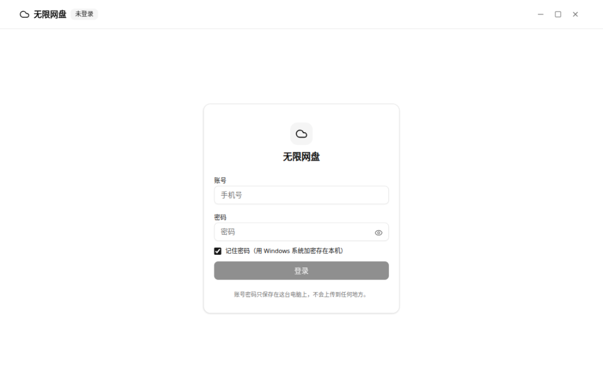

# 无限网盘

一个 Windows 桌面版的网盘管理工具。**单个 exe，双击即用，不需要装任何东西。**

底层用的是蓝奏云的文件接口 —— 但这件事你不用关心，界面、登录、上传下载都是自己的。



> 截图里的账号 uid 和分享域名做了打码处理。

---

## 这是什么

一个自用的网盘客户端，做三件事：

1. **在桌面上管理网盘文件** —— 浏览、上传、下载、分享、删除
2. **超过 100 M 的文件自动分卷** —— 切成多块放进一个文件夹，下载时一键合并还原
3. **给 AI 用** —— 内置 MCP 服务，AI 可以直接操作你的网盘

它是**真单文件**：前端界面、HTTP 服务、接口 SDK、MCP 服务全编在一个 exe 里，对外的依赖只有 Windows 自带的系统 DLL。拷到任何 Windows 上双击就能跑。

## 功能

| 功能 | 说明 |
|---|---|
| 浏览 | 自动翻页合并 —— 接口每页只给十几条，程序会翻到空页为止 |
| 进出文件夹 | 面包屑导航 |
| 搜索 | 当前目录文件名过滤 |
| 上传 | 拖拽或点选，带真实进度条 |
| **大文件分卷** | 超过 100 M 自动切块，装进一个同名文件夹 |
| 下载 | 走服务端代理（见下方「为什么不能直接给链接」） |
| **分卷合并下载** | 分卷文件夹点一下，自动拼接还原成原文件 |
| 分享 | 一键复制分享链接 + 提取码 |
| 删除 | 文件、文件夹（递归），都进回收站 |
| 右键菜单 | 右键任意文件 →「上传到无限网盘」（需先注册） |

### 分卷是个什么东西

网盘对**单个文件**有 100 M 的硬上限，**这是服务端强制的**：实测传一个 104857601 字节（超 1 字节）的文件，服务端收完整个 100 M 之后回「无效文件」。

分片上传也不行 —— 官方上传器里的 `chunked` 是注释掉的，实测把文件切成几片、带上分片字段发过去，服务端**把每一片都当成了独立的完整文件**。

所以唯一的办法是分卷：本地切开，逐块当普通文件上传。

```
拖入 电影.zip (250 M)
  ↓
网盘根目录多出一行【电影.zip】文件夹
  ├─ 电影.001.zip  100 M
  ├─ 电影.002.zip  100 M
  └─ 电影.003.zip   50 M
```

这个文件夹会带绿色「分卷」徽章，点下载按钮就是**一次普通下载** —— 服务端把各块按序拼好，你拿到的直接是完整的 250 M 原文件。



**上传是一块一个请求**，不是攒成一个请求发出去。这样进度条上的数字是「已经传完几块」的真实进度，
而且中途断线只影响正在传的那一块：

- 每块失败自动重传，最多三次（退避 2 秒、4 秒）
- 传一半关掉程序，**再拖一次同一个文件就是续传** —— 已经在网盘上的块会跳过，只补缺的
- 块不齐的时候会明确报错，不会把半截分卷当成传成功

实测 800 M：8 块，其中第 5 块撞上网盘网关的 504 超时（就是那种"传一半突然不动了"），
重来一次只补了那一块，合并下载回来 MD5 和原文件一致。

---

## 快速开始

### 1. 下载

从 [Releases](../../releases) 下载 `无限网盘.exe`，放到一个**固定的位置**（比如 `C:\Tools\`）。

> **别放下载目录然后随手清理掉** —— 右键菜单里记的是绝对路径，文件挪走了菜单就失效。

### 2. 第一次打开

双击，会弹一个登录卡：



填一次网盘账号密码就行。勾上「记住密码」的话，以后打开**直接进主界面**，不用再输。

**账号密码只保存在你这台电脑上**，用 Windows 系统自带的 DPAPI 加密（跟 Chrome 存密码是同一个机制）。它的密钥由系统从你的 Windows 登录凭据派生，所以：

- 密文拷到别的电脑 → **解不开**
- 换成别的 Windows 用户 → **解不开**

（顺带一提：这比「把密码写死在程序里」安全得多。写死的话，谁拿到 exe 谁就拿到了账号。）

### 3. 右键菜单（可选）

想要右键直接上传，跑一次：

```powershell
.\无限网盘.exe --install-menu
```

之后右键任意文件 → **显示更多选项** → **上传到无限网盘**。

> Windows 11 从 22H2 起把这类菜单项收进了「显示更多选项」，要点两下。这是系统行为，绕不过去（想进一级菜单得做 MSIX 签名包 + COM 壳扩展，代价高几十倍）。
>
> 不想要了就 `--uninstall-menu`，注册表和弹窗痕迹一次清干净。

### 4. 换账号 / 退出

主界面右上角那个「出去」图标就是**切换账号** —— 它会把本机记住的密码一起清掉，回到登录卡。

---

## 用 AI 操作网盘（MCP）

程序内置 MCP 服务，AI 客户端配一条就能用。

任意支持 MCP 的客户端（Claude Desktop / Cursor / VS Code / ZCode …），在配置里加：

```json
{
  "mcpServers": {
    "无限网盘": {
      "command": "C:\\Tools\\无限网盘.exe",
      "args": ["--mcp"]
    }
  }
}
```

**注意**：Windows 路径要写双反斜杠；必须是绝对路径；改完要**完全退出客户端**再启动。

配好之后 AI 就能直接用这八个工具：

| 工具 | 干什么 |
|---|---|
| `lzy_status` | 账号状态 |
| `lzy_list` | 列目录 |
| `lzy_find` | 按名字搜，`deep: true` 递归子目录 |
| `lzy_upload` | 传**本地路径**（不是文件内容） |
| `lzy_download` | 下到本机；分卷文件夹加 `folder: true` 自动合并 |
| `lzy_share` | 分享链接 + 提取码 |
| `lzy_mkdir` | 新建文件夹 |
| `lzy_delete` | 删除（进回收站） |

比如直接跟 AI 说「把这个文件传到网盘」「网盘里那个备份找一下」「给我个下载链接」，它就自己调这些工具。

> MCP 模式**没有界面**，所以它读的是你之前登录时存下的凭据。如果从没登录过，工具会返回一句明确提示，让你先打开一次应用。
>
> 无头场景（CI、脚本）可以用环境变量覆盖账号：`LANZOU_USER` / `LANZOU_PWD`。

---

## 命令行开关

没有面向人的命令行界面 —— 下面这些是给系统集成用的：

```
无限网盘.exe                             打开窗口
无限网盘.exe --mcp                        跑 MCP 服务（stdio）
无限网盘.exe --no-window                  只跑本地 HTTP 服务
无限网盘.exe --upload [--to <id>] <文件>   静默上传，做完弹提示框
无限网盘.exe --install-menu [--to <id>]   注册右键菜单
无限网盘.exe --uninstall-menu             拆掉右键菜单
```

环境变量：`LANZOU_PORT`（端口，默认 8790）、`LANZOU_IDLE_EXIT`（闲置退出秒数）、
`LANZOU_USER` / `LANZOU_PWD`（覆盖账号）、`LANZOU_PART_BYTES`（调小分块，方便测试）。

---

## 自己编译

需要 Rust 和 Node。

```bash
# 一次性准备
cargo install cargo-xwin
sudo apt install clang nasm lld    # ring 要编 C；llvm-lib / llvm-rc 也要在 PATH 里

# 构建
./build.sh            # 两个平台
./build.sh windows    # 只出 Windows
```

**Windows 版必须用 MSVC 目标**，两个原因：

1. `webview2-com-sys` 里写着 `#[cfg_attr(not(target_env = "msvc"), link(name = "WebView2Loader.dll"))]`
   —— GNU 目标会生成对那个 DLL 的**动态依赖**，exe 拷到别人机器上一启动就报「找不到 WebView2Loader.dll」。
2. 默认还会动态依赖 `VCRUNTIME140.dll`，所以开了 `crt-static`。

改完之后导入表里只剩 Windows 自带的系统 DLL。`build.sh` 里有三道自检：不能有外部 DLL 依赖、
必须有图标资源段、必须是 GUI 子系统 —— 哪个回退了构建会直接报错。

---

## 实现备忘

都是实测踩出来的，写下来免得以后再踩一遍。

### 阿里云 ESA 挑战

网盘全站（账号站、分享页、下载域名）都挂了阿里云的 `acw_sc__v2` JS 挑战，不解它只能拿到 4 KB 混淆脚本。

算法是固定置换表重排 + 固定 key 逐字节异或，**抄错一位就全盘失效**，而且失效的样子是「所有请求都命中挑战」，非常难查。所以有 **503 组向量做逐位对拍**（`cargo test`）。

另一个坑：**响应是 gzip 的**。阿里云 ESA 对挑战页和登录响应无条件压缩，所以不能关掉 HTTP 库的透明解压 —— 否则挑战页在我们眼里是乱码，连 `arg1` 都搜不出来。

### 上传接口不认 `folder_id`

想把文件传进指定文件夹，把 `folder_id` 放表单字段、URL 查询串，或换成 `folder_id_bibao` / `fol_id` / `parent_id` —— **七种形式全部落根目录**。

所以只能先传到根目录，再调 `task=20` 移动进去。

### 文件夹名的限制比文件名严得多

文件名可以是「我的 电影 (1).zip」，但**同样的名字做文件夹名会被拒**。

实测：半角空格、`( ) # + , ' % $ = ; : * ? " < |` 和全角空格都不行；
`_ - . [ ] ~ ! @ &` 和中文正常。程序会自动把不接受的字符换成下划线。

### 直链只经得起一次请求

下载直链有挑战，而且**同一条链接被第二个请求碰过之后就失效**。所以不能「先探一下再重连」，
也不能把链接甩给浏览器（浏览器会二次请求，直接拿到失效页）。

程序的做法：服务端代理，用 `bufio` 只 `Peek` 不消费来判断是不是挑战页，不是就直接把缓冲区
原样转给下游 —— 已读字节不用接力，`Content-Length` 也不用扣减。

### 每次调用都登录会被限流

不存会话的话，一次调用要 4 个请求（含一次登录），连跑十几个命令服务端就回 403/409。

所以会话必须存盘。存了之后每次调用只剩 1 个业务请求。

### 同名文件是并存两份，不是覆盖

重传、续传都要求"同一块传两次，结果只有一份"，但蓝奏云不是这个语义：
同一个文件夹里放进两个同名文件，**两份都在**，谁也不覆盖谁。

所以每块上传前会先把同名旧块删掉（顺带把文件名取法统一到一个函数里，免得续传扫描
和合并时对不上）。不这么做的话，一次失败重试就会留下重复块 —— 合并时序号连续校验
直接判死，整个分卷作废。

好处是**重传天然幂等**：一块传几次都对，续传也就不需要额外的状态表。

### 大文件是前端切块，不是服务端切块

以前是「前端一个请求把整个大文件发给本机服务，服务端内部再切块转发」。700 M 那种一个请求
要活三分钟以上，中间任何一层（浏览器、代理、网盘网关）掐断就整单白传 —— 用户看到的表现
就是"传了 100 M 之后突然不动了，也不报错"。

现在是前端按服务端下发的块大小切片，一块一个请求：

```
POST /api/upload/begin   → 建/复用文件夹，回「几块、每块多大、哪些块已在网盘上」
POST /api/upload/part    → 传一块（原始字节，一个请求就活几十秒）
POST /api/upload/finish  → 校验块齐了没有
```

块大小由服务端算（`LANZOU_PART_BYTES` 可调，方便用小文件测分卷），前端不重复这个常量。

**合并下载故意不带 `Content-Length`**：每块多大只能从列表里那个人类可读的字符串反推
（"1.9 M"），反推出来的长度会差几十字节 —— 一个**错的** `Content-Length` 会让浏览器
一直等字节，比没有更糟。所以分卷下载走 chunked，进度条看不到总大小。

### GUI 子系统下不能用 `println!`

Windows GUI 子系统从资源管理器启动时没有控制台、标准句柄是空的，而 Rust 的 `println!`
写失败时会 **panic** —— 程序一启动就崩。所以统一用一个容错的宏往 stderr 写。

---

## 项目结构

```
src/
├── main.rs          入口：开窗口 / --mcp / 系统集成开关
├── acw.rs           ESA 挑战算法（含 503 组对拍测试）
├── creds.rs         账号凭据的 DPAPI 加密存储
├── mcp.rs           MCP 服务（JSON-RPC over stdio，8 个工具）
├── ops.rs           上传 / 下载 / 提示，MCP 和右键菜单共用
├── httpd.rs         HTTP 路由 + 流式转发 + 托管内嵌前端
├── server.rs        业务逻辑（列表 / 上传 / 分卷 / 搜索）
├── lanzou/          网盘接口 SDK：会话 / 登录 / 直链 / cookie
├── window_win.rs    Windows 无边框窗口（tao + wry）
├── menu_win.rs      右键菜单注册表
└── notify_win.rs    user32 弹窗
web/                 前端（Vite + React 19 + TypeScript + Tailwind 4）
assets/              图标（zmoee.svg 是源，icon.ico 是生成好随源码带的）
docs/                接口文档与截图
```

### 运行时会在哪写东西

exe 本身只有一个文件，跑起来会在**用户目录**下建这些：

| 位置 | 内容 |
|---|---|
| `%LOCALAPPDATA%\lzy\webview\` | WebView2 的缓存（浏览器内核要用） |
| `%APPDATA%\lzy\cookies.json` | 登录会话 |
| `%APPDATA%\lzy\credentials.dat` | **DPAPI 加密后**的账号密码 |

**exe 所在目录始终是干净的** —— 配置目录被显式指到了用户目录（WebView2 默认会建在 exe 旁边，那样会弄脏程序目录）。

### 安全说明

- 账号密码用 DPAPI 加密，绑定到「这台机器 + 这个 Windows 用户」，密文离开本机解不开
- 本地 HTTP 接口校验 `Host` 头，只接受 `127.0.0.1` / `localhost` / `[::1]`
  —— 这是挡 **DNS rebinding**：恶意网页把域名解析到 127.0.0.1 后，会以那个域名的身份访问本地接口
- 删除都是进回收站，不是永久删除

---

## 许可

自用工具，未附许可证。
